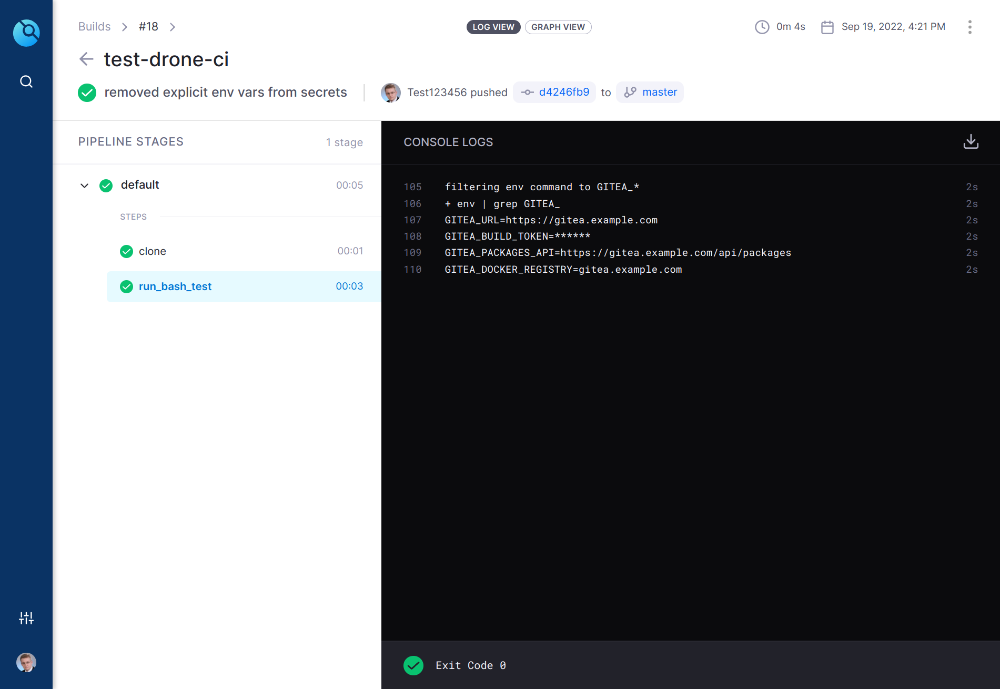

# Drone Gitea Secret Extension

An extension to improve Gitea/Drone integration, creating a temporary per-pipeline access tokens with access scoped to
the owner of the build job and injecting it as environment variables into the build.



## Installation

### Create a shared secret:

```bash
openssl rand -hex 16
```

### Download and run the plugin via docker:

```console
$ docker run -d \
  -p 3000:3000 \
  --env=DRONE_DEBUG=true \
  --env=DRONE_SECRET=<shared-secret> \
  --restart=always \
  --name=drone-gitea-secret-extension \
  ghcr.io/davidhiendl/drone-gitea-secret-extension:master
```

### Deploy the plugin to Kubernetes via Helm:
See folder [./charts](./charts)

### Environment Plugin Configuration

Automatically injects environment variables into the build. Requires less boilerplate than the secret plugin alternative
but creates a token and injects the environment variables into every build regardless if it is needed.

| Key | Value | Example |
|-----------------------|--|---------|
| GITEA_URL | A URL pointing to the Gitea instance. | https://gitea.example.com         |
| GITEA_BUILD_TOKEN | A Gitea API token for API, packages and docker registry access. | xxxxxxxxxxxxxxxx |
| GITEA_PACKAGES_API | A URL pointing to the Gitea packages endpoint. | https://gitea.example.com/api/packages        |
| GITEA_DOCKER_REGISTRY | A hostname for the Gitea docker registry. | gitea.example.com |

Update your runner configuration to include the plugin address and the shared secret as environment variable:

```bash
DRONE_ENV_PLUGIN_ENDPOINT=http://1.2.3.4:3000/environ
DRONE_ENV_PLUGIN_TOKEN==<shared-secret>
```

Use in pipelines:

```yaml
kind: pipeline
name: default

steps:
  - name: build
    image: alpine
    commands:
      - echo "running env command"
      - env
      - echo "filtering env to GITEA_*"
      - env | grep GITEA_
```

### Secret Plugin Configuration

Update your runner configuration to include the plugin address and the shared secret as environment variable:

```bash
DRONE_SECRET_PLUGIN_ENDPOINT=http://1.2.3.4:3000/secret
DRONE_SECRET_PLUGIN_TOKEN=<shared-secret>
```

Use in pipelines:

```yaml
kind: pipeline
name: default

steps:
- name: build
  image: alpine
  environment:
    GITEA_URL:
      from_secret: gitea_url
    GITEA_TOKEN:
      from_secret: gitea_build_token
    GITEA_PACKAGES_URL:
      from_secret: gitea_packages_url
    GITEA_DOCKER_REGISTRY:
      from_secret: gitea_docker_registry
  commands:
    - echo "running env command"
    - env
    - echo "filtering env to GITEA_*"
    - env | grep GITEA_

---
kind: secret
name: gitea_url
get:
  path: gitea
  name: url

---
kind: secret
name: gitea_build_token
get:
  path: gitea
  name: build_token

---
kind: secret
name: gitea_packages_url
get:
  path: gitea
  name: packages_url

---
kind: secret
name: gitea_docker_registry
get:
  path: gitea
  name: docker_registry
```

